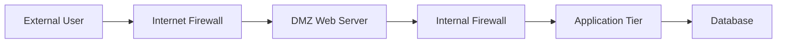

# 06 Network Security

This wiki explains the network security portion of the Cybersecurity Architecture Series in a clear, page-based format.

## Page Map

| Page | What you will learn |
|---|---|
| [Firewalls](https://github.com/alishahbaz/Cybersecurity-Architecture-Network-Security/wiki/Firewalls) | Packet filtering, stateful inspection, proxies, NAT |
| [Segmentation](https://github.com/alishahbaz/Cybersecurity-Architecture-Network-Security/wiki/Segmentation) | DMZs, bastion hosts, tri-homed firewalls, multi-tier segmentation |
| [VPNs](https://github.com/alishahbaz/Cybersecurity-Architecture-Network-Security/wiki/VPNs) | Secure channels over untrusted networks, OSI layer examples |
| [SASE](https://github.com/alishahbaz/Cybersecurity-Architecture-Network-Security/wiki/SASE) | Secure Access Service Edge, SD-WAN, cloud-delivered security |
| [Not Covered](https://github.com/alishahbaz/Cybersecurity-Architecture-Network-Security/wiki/Not-Covered) | Topics mentioned but not covered in this transcript |

## Big-Picture Network Diagram

## Core Principles

1. **Isolate dangerous areas.** Keep untrusted traffic away from sensitive data.
2. **Apply rules at boundaries.** Firewalls decide what can cross between zones.
3. **Use defense in depth.** Do not rely on a single firewall or control.
4. **Protect data in motion.** Use VPNs and encryption over untrusted networks.
5. **Modernize delivery.** SASE combines networking and security in the cloud.

## Suggested Reading Path

1. [Firewalls](https://github.com/alishahbaz/Cybersecurity-Architecture-Network-Security/wiki/Firewalls)
2. [Segmentation](https://github.com/alishahbaz/Cybersecurity-Architecture-Network-Security/wiki/Segmentation)
3. [VPNs](https://github.com/alishahbaz/Cybersecurity-Architecture-Network-Security/wiki/VPNs)
4. [SASE](https://github.com/alishahbaz/Cybersecurity-Architecture-Network-Security/wiki/SASE)
